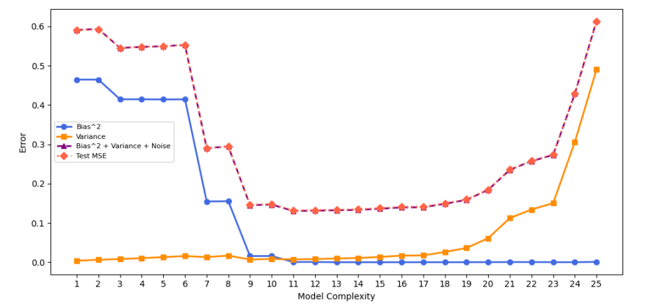

# Bias-Variance Decomposition & The Double Descent Phenomenon

This collaborative project derives the classical bias-variance decomposition, validates theory through polynomial regression experiments, and explores the double descent phenomenon as models enter *over-parameterized* regimes.

The foundational idea suggests that the mean squared error decomposes into three parts: the model's bias squared, variance, and irreducible noise. From a regression point of view, the decomposition says:

$$
\mathbb{E}_{\mathcal{D},\varepsilon}\left[(\hat{f}(x) - Y)^2\right] = \left(\mathbb{E}_{\mathcal{D}}[\hat{f}(x)] - f^*(x)\right)^2 + \mathbb{E}_{\mathcal{D}}\left[(\hat{f}(x) - \mathbb{E}_{\mathcal{D}}[\hat{f}(x)])^2\right] + \sigma^2,
$$

indicating the estimator's bias squared, variance, and noise terms respectively in the RHS (Sections 2 & 3).

Intuition tells us that test error continues to rise as regression models begin to overfit training data, but in reality, we see a second decent in test error once models surpass a specific complexity threshold (Section 5).
